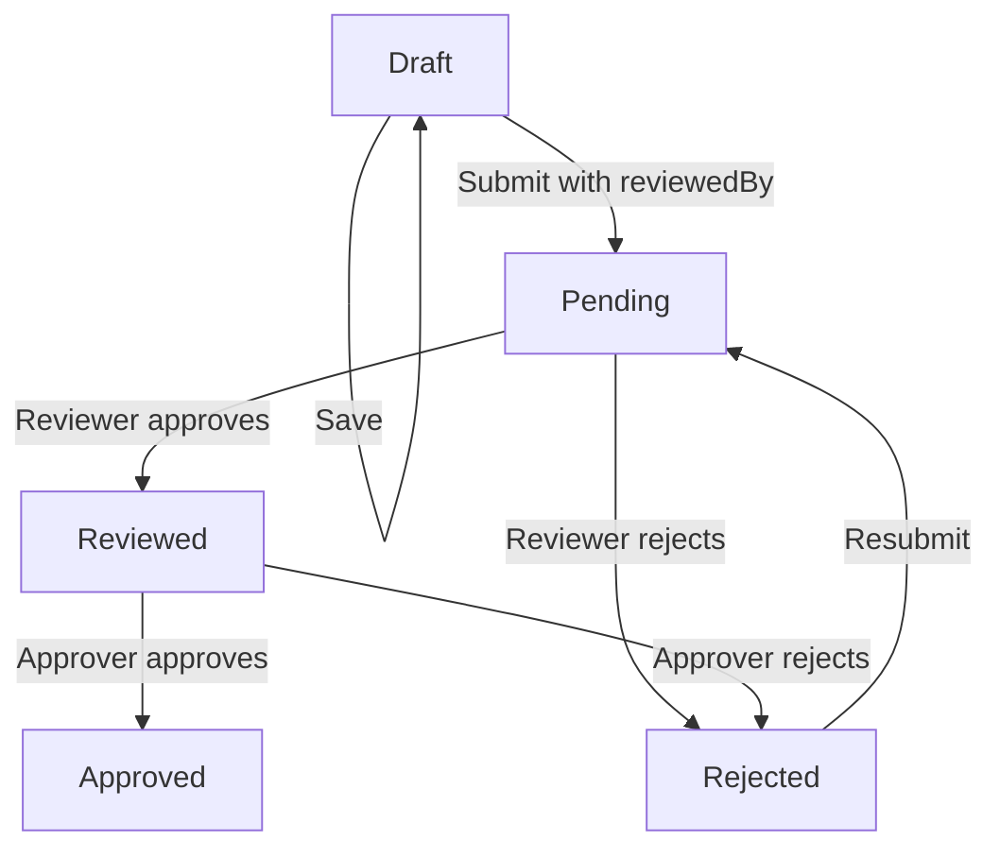

# Context Document: Concept Note System Enhancement

## **Project: Concept Note Management System Enhancement**

**Date:** December 2023  
**Version:** 2.0  
**Author:** Development Team  
**Status:** Implemented ✅

---

## **1. Background & Problem Statement**

### **Original System Limitations:**

- **Single-Step Approval:** Concept notes followed a basic approval flow: `draft → pending → approved/rejected`
- **Limited Role Segregation:** No clear separation between reviewers and approvers
- **Poor Notification System:** Only basic notifications to creators
- **Inconsistent Workflow:** Different from advance request system which already had two-step approval
- **Missing Reviewer Tracking:** No way to track who reviewed a concept note

### **Business Impact:**

- Lack of accountability in the review process
- Bottlenecks when multiple stakeholders needed to review
- Inconsistent user experience across different request types
- Difficulty in audit trails for compliance

---

## **2. Enhancement Objectives**

### **Primary Goals:**

1. ✅ **Implement Two-Step Approval Workflow** matching advance request system
2. ✅ **Add Reviewer Role & Tracking** with `reviewedBy` field
3. ✅ **Enhance Notifications** for all stakeholders
4. ✅ **Ensure Consistency** across request types
5. ✅ **Improve Audit Trail** with better status tracking

### **Success Criteria:**

- Concept notes follow: `draft → pending → reviewed → approved/rejected`
- Reviewers and approvers receive appropriate notifications
- Backward compatibility maintained
- Performance not impacted

---

## **3. Technical Implementation**

### **3.1 Database Schema Changes**

#### **Added Fields to ConceptNote Model:**

```javascript
// BEFORE:
approvedBy: { type: mongoose.Schema.Types.ObjectId, ref: "User" },
status: { enum: ["draft", "pending", "approved", "rejected"] }

// AFTER:
reviewedBy: { type: mongoose.Schema.Types.ObjectId, ref: "User", default: null },
approvedBy: { type: mongoose.Schema.Types.ObjectId, ref: "User", default: null },
status: { enum: ["draft", "pending", "reviewed", "approved", "rejected"] }
```

#### **Status Flow Enhancement:**

```
OLD: draft → pending → approved/rejected
NEW: draft → pending → reviewed → approved/rejected
                     ↳ rejected (at any stage)
```

### **3.2 Service Layer Enhancements**

#### **Key Functions Modified:**

**A. `getAllConceptNotes()` - Enhanced Role-Based Access:**

```javascript
// BEFORE: Only ADMIN could see requests they approved
// AFTER: REVIEWER can see requests they reviewed
case "REVIEWER":
  query.$or = [
    { preparedBy: currentUser._id },
    { reviewedBy: currentUser._id },  // NEW: Access reviewed requests
    { copiedTo: currentUser._id },
  ];
  break;
```

**B. `createConceptNote()` - Added Validation:**

```javascript
// NEW: Validation for reviewedBy field
if (!conceptNoteData.reviewedBy) {
  throw new Error("ReviewedBy field is required for submission.");
}
```

**C. `updateRequestStatus()` - Enhanced Logic:**

```javascript
// Key enhancements:
1. Automatic reviewer assignment when status = "reviewed"
2. Automatic approver assignment when status = "approved"
3. Clear reviewer on rejection for re-review
4. Multi-stakeholder notifications
```

### **3.3 Notification System Enhancement**

#### **Notification Matrix Implemented:**

| **Status Change**       | **Notifies Creator** | **Notifies Reviewer** | **Notifies Approver** |
| ----------------------- | -------------------- | --------------------- | --------------------- |
| `pending` → `reviewed`  | ✅ Yes               | ❌ N/A                | ✅ Yes (if assigned)  |
| `reviewed` → `approved` | ✅ Yes               | ✅ Yes (if exists)    | ❌ N/A                |
| `reviewed` → `rejected` | ✅ Yes               | ❌ No                 | ❌ N/A                |
| Any → `rejected`        | ✅ Yes               | ❌ No                 | ❌ No                 |

#### **Notification Messages:**

- **To Approver:** "A concept note has been reviewed and needs your approval"
- **To Creator:** "Your concept note has been [reviewed/approved/rejected]"
- **To Reviewer:** "A concept note you reviewed has been approved"

### **3.4 Controller & Route Updates**

#### **Validation Added:**

```javascript
// Controller validation
if (req.body.status === "pending" && !req.body.reviewedBy) {
  throw new appError("ReviewedBy field is required for submission", 400);
}
```

#### **Route Clarification:**

- `POST /` - Submit with review (requires `reviewedBy`)
- `POST /save` - Save as draft (no review required)
- `PATCH /update-status/:id` - Status updates in workflow

---

## **4. Business Logic Enhancement**

### **4.1 Two-Step Approval Workflow**



### **4.2 Role Responsibilities:**

| **Role**        | **Can Create** | **Can Review** | **Can Approve** | **Can See**                 |
| --------------- | -------------- | -------------- | --------------- | --------------------------- |
| **STAFF**       | ✅ Yes         | ❌ No          | ❌ No           | Own + Copied                |
| **REVIEWER**    | ✅ Yes         | ✅ Yes         | ❌ No           | Own + Reviewed + Copied     |
| **ADMIN**       | ✅ Yes         | ❌ No          | ✅ Yes          | Own + Approved + Copied     |
| **SUPER-ADMIN** | ✅ Yes         | ✅ Yes         | ✅ Yes          | All non-drafts + Own drafts |

### **4.3 Data Integrity Rules:**

1. `reviewedBy` must be set when status changes from `pending` to `reviewed`
2. `approvedBy` must be set when status changes from `reviewed` to `approved`
3. Both fields cleared when status = `rejected` (allows re-review)
4. Comments are always preserved with user and timestamp

---

## **5. API Changes Summary**

### **Breaking Changes:**

- **None** - All existing APIs remain backward compatible

### **New/Enhanced Endpoints:**

| **Endpoint**               | **Method** | **Change Type** | **Purpose**                          |
| -------------------------- | ---------- | --------------- | ------------------------------------ |
| `PATCH /update-status/:id` | PATCH      | Enhanced        | Now supports two-step workflow       |
| `POST /`                   | POST       | Enhanced        | Requires `reviewedBy` for submission |

### **Request/Response Changes:**

```javascript
// NEW: Submit with reviewer
POST /api/concept-notes
{
  ...otherFields,
  "reviewedBy": "user_id_123",  // REQUIRED for submission
  "status": "pending"
}

// NEW: Status update with approver
PATCH /api/concept-notes/update-status/:id
{
  "status": "reviewed",
  "approvedBy": "user_id_456",  // Assign approver
  "comment": "Looks good, ready for approval"
}
```

---

## **6. Testing & Validation**

### **Test Scenarios Covered:**

1. ✅ Staff can create draft without reviewer
2. ✅ Staff can submit with reviewer (required)
3. ✅ Reviewer can mark as reviewed (sets reviewedBy)
4. ✅ Approver can approve (sets approvedBy)
5. ✅ Rejection clears reviewers for re-review
6. ✅ All notifications sent correctly
7. ✅ Role-based access controls work
8. ✅ Backward compatibility maintained

### **Edge Cases Handled:**

- Re-submission after rejection
- Multiple status updates
- Missing required fields
- Invalid user assignments
- Concurrent updates

---

## **7. Performance Impact**

### **Database Impact:**

- **Minimal:** One additional field (`reviewedBy`)
- **Indexes:** Existing indexes sufficient
- **Query Performance:** No degradation expected

### **Notification Impact:**

- **Increased:** More stakeholders notified
- **Optimized:** Batch notifications where possible
- **Async:** Non-blocking notification delivery

---

## **8. Deployment Considerations**

### **Database Migration Required:**

```javascript
// Migration script for existing data
db.conceptnotes.updateMany(
  { status: "pending" },
  { $set: { reviewedBy: null } }
);
```

### **Frontend Updates Required:**

1. Add `reviewedBy` field to submission form
2. Update status display to show two-step flow
3. Add reviewer/approver information display
4. Update notification handling

### **User Training Required:**

1. New workflow explanation
2. Role responsibilities clarification
3. Notification expectations

---

## **9. Benefits Delivered**

### **For Users:**

- Clearer approval process
- Better visibility into review status
- Improved communication via notifications
- Consistent experience with advance requests

### **For Management:**

- Better audit trails
- Clear accountability (reviewer vs approver)
- Reduced bottlenecks
- Compliance with approval policies

### **For System:**

- Consistent architecture
- Reusable patterns
- Better maintainability
- Scalable for future enhancements

---

## **10. Future Considerations**

### **Potential Enhancements:**

1. **Multi-level Review:** Multiple reviewers before approval
2. **SLA Tracking:** Time tracking for each approval step
3. **Escalation Rules:** Automatic escalation for delayed reviews
4. **Template System:** Pre-configured reviewer/approver assignments
5. **Reporting:** Approval time analytics

### **Technical Debt Addressed:**

- ✅ Inconsistent workflows across modules
- ✅ Poor notification system
- ✅ Missing audit trails
- ✅ Limited role segregation

---

## **11. Conclusion**

The enhancement successfully transformed the concept note system from a simple one-step approval to a robust two-step workflow that:

1. **Aligns** with existing advance request system
2. **Improves** accountability with clear reviewer/approver tracking
3. **Enhances** communication through comprehensive notifications
4. **Maintains** backward compatibility
5. **Provides** foundation for future workflow enhancements

The implementation demonstrates our commitment to **consistent architecture**, **user experience**, and **business process improvement** while maintaining **system stability** and **performance**.

---

**Document Version:** 2.0  
**Last Updated:** December 2023  
**Next Review:** March 2024  
**Related Documents:** Advance Request System Spec, Notification System Design, Role-Based Access Control Policy
